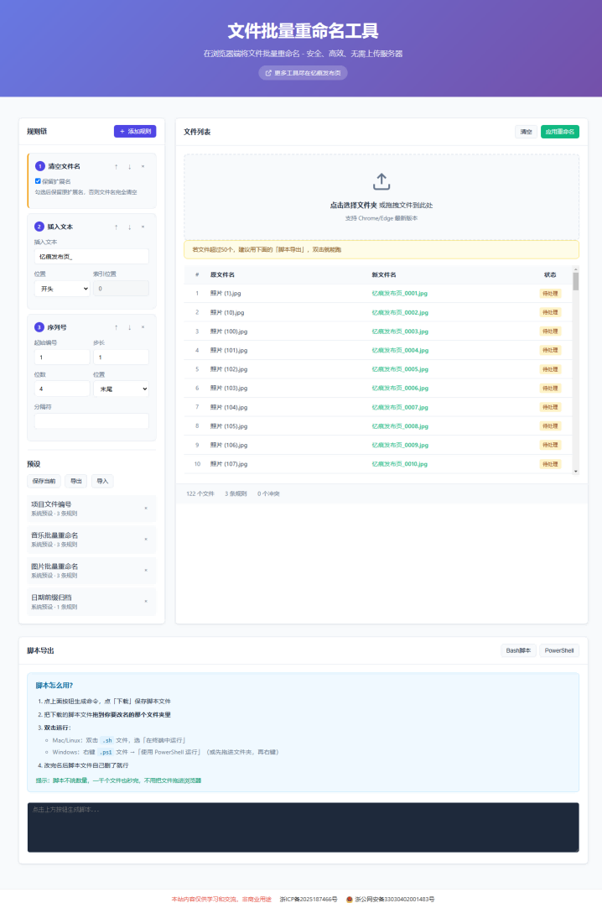

# 文件批量重命名工具

一款纯前端实现的文件批量重命名工具，所有操作均在浏览器本地完成，无需上传服务器，保障文件隐私安全。

演示地址：https://filerename.937788.xyz/


## 功能特性

### 重命名规则

- **查找替换**：普通文本查找替换，支持区分大小写
- **正则表达式**：正则匹配替换，支持自定义 flags
- **序列号**：自动添加递增编号，支持起始值、步长、位数、位置和分隔符
- **大小写转换**：支持小写、大写、首字母大写、驼峰命名
- **插入文本**：在开头、末尾或指定索引位置插入文本
- **删除清理**：按位置删除字符，或删除匹配指定模式的文本
- **清空文件名**：一键清空文件名，可选保留扩展名
- **自定义 JS**：使用 JavaScript 代码实现任意重命名逻辑（可用变量：name, ext, index, originalName）

### 规则链机制

- 支持添加多条规则，按顺序依次执行
- 规则可随时上移/下移、删除
- 实时预览重命名结果
- 自动检测文件名冲突并标记

### 预设管理

- 保存当前规则为预设，方便重复使用
- 内置 4 种预设模板：
  - 项目文件编号（PROJECT_001, PROJECT_002...）
  - 音乐批量重命名（Music_0001, Music_0002...）
  - 图片批量重命名（IMG_0001, IMG_0002...）
  - 日期前缀归档（YYYYMMDD_原文件名）
- 支持预设的导入/导出（JSON 格式），方便备份和分享
- 预设数据存储在浏览器 localStorage 中

### 安全与隐私

- 纯前端实现，文件无需上传到任何服务器
- 支持 File System Access API，可直接在本地文件夹中重命名
- 提供脚本导出功能，生成 Bash/PowerShell 脚本离线执行


## 使用方法

### 方式一：浏览器直接重命名（少量文件）

1. 点击拖拽区域选择文件夹，或直接将文件拖拽到页面
2. 在左侧「规则链」面板点击「添加规则」，选择需要的规则类型
3. 配置规则参数，右侧文件列表会实时预览新文件名
4. 确认无误后点击「应用重命名」直接修改本地文件，稍作等待即可。

要求：Chrome 86+ 或 Edge 86+ 浏览器，且需要用户授权文件夹读写权限

### 方式二：脚本导出（适合大量文件）

1. 添加文件和规则后，滚动到页面底部「脚本导出」区域
2. 点击「Bash 脚本」或「PowerShell」按钮生成对应脚本
3. 脚本会自动下载，将其拖入目标文件夹：
   - Mac/Linux：双击 .sh 文件，选择「在终端中运行」
   - Windows：右键 .ps1 文件 ->「使用 PowerShell 运行」
4. 运行完成后删除脚本文件即可

提示：若文件超过 50 个，建议使用脚本导出功能，双击即可批量执行，效率更高。


## 技术栈

- HTML5 - File API、File System Access API、拖拽上传
- Vanilla JavaScript - 无框架依赖，轻量高效
- CSS3 - 响应式布局，支持移动端访问


## 浏览器兼容性

- 文件选择/拖拽：Chrome、Edge、Firefox、Safari 均支持
- 实时预览：Chrome、Edge、Firefox、Safari 均支持
- 脚本导出：Chrome、Edge、Firefox、Safari 均支持
- 直接重命名：仅 Chrome 86+ 和 Edge 86+ 支持


## 本地运行

```bash
# Python 3
python -m http.server 8080

# 或Node.js
npx serve .

# 然后访问 http://localhost:8080
```


## 文件结构

```
├── index.html      # 主页面结构（含备案信息）
├── style.css       # 样式表（含响应式布局、动画、主题变量）
├── app.js          # 核心逻辑（文件处理、规则引擎、预设管理、脚本导出）
└── README.md       # 本文件
```

### 核心模块说明

- 文件处理：handleFiles(), clearFiles() - 支持多文件选择和拖拽
- 规则引擎：addRule(), applyRules(), renderRules() - 8 种规则类型，链式执行
- 冲突检测：checkConflicts() - 自动检测重复文件名
- 预设管理：savePreset(), loadPreset(), renderPresets() - localStorage 持久化
- 脚本导出：exportScript(), downloadFile() - 生成 Bash/PowerShell 脚本
- 直接重命名：applyRename() - 使用 File System Access API 读写本地文件


## 注意事项

1. 直接重命名功能需要浏览器支持 File System Access API，且需要用户授权文件夹读写权限
2. 重命名前请确认文件未被其他程序占用
3. 大量文件时，建议使用「脚本导出」功能，生成重命名命令，保存在要修改的目录内，双击运行即可
4. 文件名冲突检测会自动标记冲突文件，需修改规则解决冲突后才能应用
5. 自定义 JS 规则中可使用变量：name（文件名）、ext（扩展名）、index（索引）、originalName（原始文件名）


## 免责声明

本站内容仅供学习和交流，非商业用途。

## 截图

